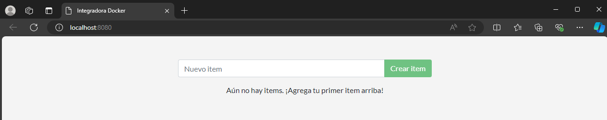
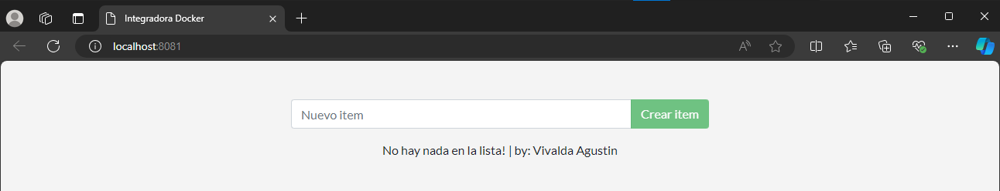

# Fundamentos y usos prácticos de Docker

## Entregable trabajo integrador: [Su nombre y apellido]


## Parte 1 - Conteinerizar una Aplicación


### Creando la imágen

- Ejecute el comando correspondiente para buildear la imágen. Elija un nombre de imágen y un tag acorde. 

    ```bash
    docker build -t tp-final:v1.0 C:\Users\agustin.vivalda\Desktop\capacitacion\docker-integradora\app\

    ```
- Muestre cuánto espacio ocupa la imaǵen una vez creada.

    ```bash
    docker image ls
    ```  
- ¿Puede hacer algo para optimizar o mejorar la imágen?. Describa qué modificaciones puede hacer para optimizar la imágen.

_Utilizar alguna distribucion más liviana y descargar las herramientas especificas que se utilizaran _


### Correr la aplicación

Una vez creada la imágen, debería ser capaz de correr la aplicación.


- Ejecute un comando para poder correr la aplicación.
    ```bash
    # docker run -d -p 8080:3000 tp-final
    ```
- Explique el comando y cada parámetro enviado.

    _-d : indica que el contenedor se ejecuta en segundo plano, osea que si la termina se cierra el contenedor continúa ejecutándose 
    -p 8080:3000 : indica que la aplicacion esta escuchando en el puerto 3000 y que se mostrará en localhost://8080
    tp_final:v1.0 : indica el contenedor que hay que correr con su respectiva version _
- Muestre una captura de pantalla o un copy-paste del contenedor corriendo.

    _CONTAINER ID   IMAGE           COMMAND               CREATED          STATUS          PORTS                    NAMES
313b81797b31   tp-final:v1.0   "node src/index.js"   17 minutes ago   Up 17 minutes   0.0.0.0:8080->3000/tcp   confident_vaughan_

- Adjunte una captura de pantalla con la aplicación funcionando con la URL utilizada para acceder.

    


## Parte 2 - Actualizar aplicación (imágen)

### 1. Actualizar el código fuente

- Ejecutemos los comando necesarios para que la aplicación tome los cambios. Realice un etiquetado (tag) coherente respecto a los cambios en la imágen
    
    ```bash
    # docker build -t tp-final:v1.1 .       //re-buildeo para que tome el cambio de código
    # docker run -d -p 8081:3000 --name v1.1 tp-final:v1.1        // lo corro en un puerto distinto al anterior para tener ambos en simultáneo y le pongo un nombre al contenedor
    
    ```

- Mostrar captura de pantalla con la app corriendo con las modificaciones realizadas.

    

> La actualizaciones realizadas, dejan a la primera versión obsoleta

### 2. Elimine el contenedor e imágen anterior

- Elimine la imágen y el contenedor hecho en el punto anterior

    ```bash
    # docker stop 313b81    // detengo la ejecucion del contenedor utilizando la primer parte del containerID
    # docker rm 313b81      // elimino el contenedor detenido
    # docker rmi c332       // elimino la imagen obsoleta utilizando la primer parte del imageID
    ```

- Liste las imágenes y contenedores para ver que ya no existen.

    ```bash
    # docker ps -a
    # docker images
    ```


## Parte 3 - Compartir app

Para compartir la imágen de la aplicación usaremos la registry de [DockerHub](https://hub.docker.com/).

> [!TIP]
> Repase lo realizado en el [Laboratorio 2.3](https://github.com/kity-linuxero/docker_410_practicas/blob/main/labs/02-conceptos-basicos/23-images-push.md#3-subimos-a-la-registry).


- Escriba los comandos necesarios para que sea posible subir la imaǵen correctamente.

    ```bash
    # docker image tag tp-final:v1.1 dazzledd/tp-final:v1.1
    # docker login
    # docker push dazzledd/tp-final:v1.1
    ```

- Comparta la URL de DockerHub para que pueda ser posible probar y descargar su imágen.VA

    [Actualice el link](https://hub.docker.com/repository/docker/dazzledd/tp-final/general)

- Agregue un _overview_ para el repositorio de Dockerhub con instrucciones para correr la imágen y todo lo que considere necesario para que un tercero pueda ejecutar la imágen.

> [!TIP]
> Utilice el formato [markdown](https://docs.github.com/es/get-started/writing-on-github/getting-started-with-writing-and-formatting-on-github/basic-writing-and-formatting-syntax) para darle formato al overview.


## Parte 4 - Persistencia de datos

Los datos en esta APP se guardan en un archivo `/etc/todos/todo.db`.

- Escriba los comandos utilizados para realizar lo solicitado con la explicación correspondiente.

    ```bash
    # docker volume create vol-entregable      // creamos el volumen
    # docker run -d -p 8080:3000 -v vol-entregable:/etc/todos/todo.db tp-final:v1.1  // corremos la imagen con su respectivo volumen 
    ```

- Decida que tipo de persistencia es la adecuada para la app.
 Lo mas adecuado es una persistencia en volumenes ya que presentan varias ventajas tales como facilidad para realizar copias de seguridad, administración del volumen a traves de comandos y se crea al momento de levantar la aplicación. 
> [!TIP]
> Repase [volúmenes y persistencia](https://docker.idepba.com.ar/clase4.html#/volumenes) de datos.


## Parte 5 - Aplicaciones multicontainer


- [Crear una red](https://docker.idepba.com.ar/clase4.html#/network_create) para conexión entre los contenedores que servirá también para conectar a la aplicación.

    ```bash
    # docker network create net-entregable
    ```
- [Crear un nuevo volumen](https://docker.idepba.com.ar/clase4.html#/volume_create) para persistir los datos de la base MySQL. El path donde se almacenan los datos en el contenedor MySQL es `/var/lib/mysql`.
    
    ```bash
    # docker volume create vol-entregable
    ```
- Iniciar el contenedor de la aplicación utilizando el comando `docker run` enviando las variables de entornos necesarias para la conexión con la base de datos.

    ```bash
    # docker run --name mysql -v vol-entregable:/var/lib/mysql -e MYSQL_ROOT_PASSWORD=my-secret-pw,MYSQL_DATABASE=todos -d mysql:8.0
    ```

> [!TIP]
> Set environments variables (-e, --env) [Docker Docs](https://docs.docker.com/reference/cli/docker/container/run/#env).


## Parte 6 - Utilizando Docker Compose

En la carpeta raíz del proyecto, cree un archivo de docker compose `compose.yml` o `docker-compose.yml`. Adicionalmente pégue el contenido del archivo `compose` en este lugar:

```compose
# 
name: todolist
services:
    mysql:
        container_name: mysql
        image: mysql:8.0
        volumes:
            - vol-entregable:/var/lib/mysql
        environment:
            MYSQL_USER: tpfinal
            MYSQL_PASSWORD: tpfinal
            MYSQL_ROOT_PASSWORD: tpfinal
            MYSQL_DATABASE: todos

    tp-final:
        image: dazzledd/tp-final:v1.1
        ports:
            - 8080:3000
        environment:
            MYSQL_HOST: mysql
            MYSQL_USER: tpfinal
            MYSQL_PASSWORD: tpfinal
            MYSQL_DB: todos
        depends_on: 
           - mysql
        restart: always
networks:
    net-entregable:
        name: net-entregable
volumes:
    vol-entregable:
        name: vol-entregable
```

> [!IMPORTANT]  
> El instructor debe ejecutar el comando `docker compose up` y la aplicación debe descargarse y ejecutarse correctamente.

----


<p align="center">
  
</p>


